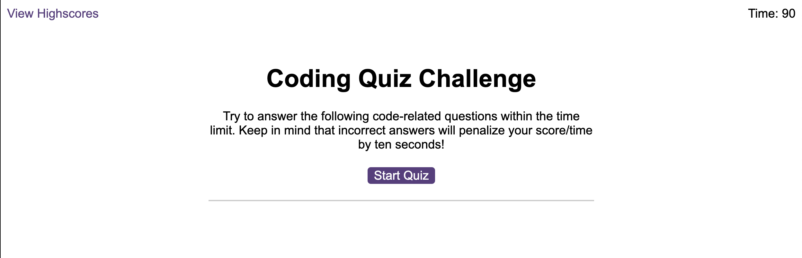
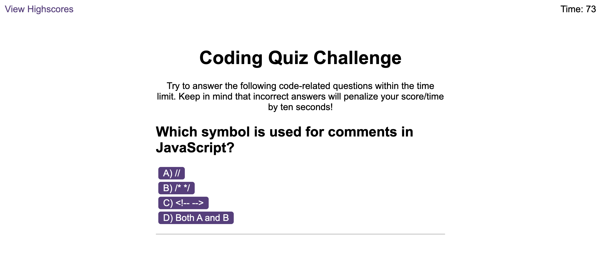
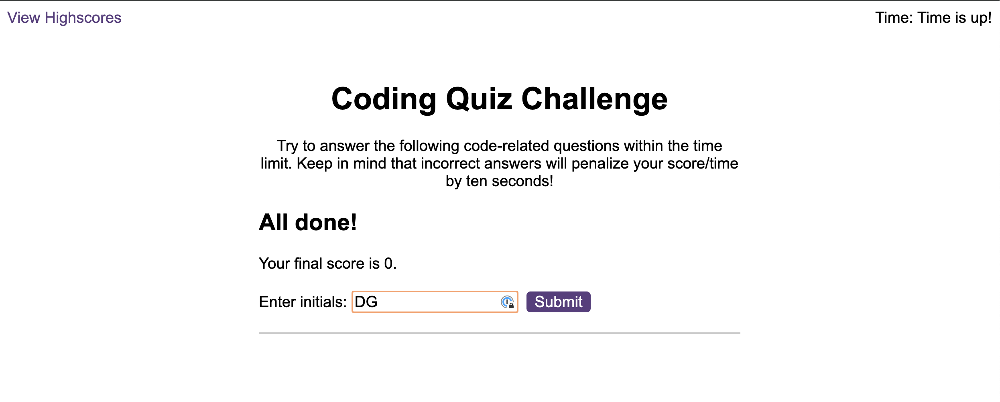
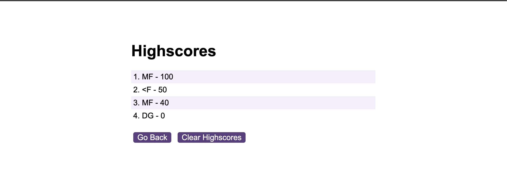

# Coding Quiz

## Description
This application is a quiz which is designed to test the user's knowledge of Jvascript fundamentals. The rules are very simple and are as follows:

* There are currently ten questions to be answered.
* The user has 90 seconds in order to complete the quiz.
* When a question is answered incorrectly, a further 10 secods is removed from the timer.
* Each correct question is worth 10 points, with the total score being showcased once the timer ends.

**The functionality is achieved through the following means:**

* Questions provided via an array within the **question.js file**.
* The majority of the game functionality can be found within the **scores.js file**.
  * Document query selectors used to find HTML elements and Add/Remove element methods used to dynamically updaed the game content.
  * Timer is set to 90 seconds within a timer variable, with setInterval function used to decrement the time by 1 second.
  * ForEach loops used to cycle through questions and add a new one each time an answer has been given.
  * Score and initials logged to local storage, to be retrieved on the highscores page.
  * Event Listeners used to start game and submit score.
* The **scores.js** file contains getItem function to retrieve the scores data and then adds it to the list.

## Installation
To review the portfolio, please follow this URL: https://michaelfriel.github.io/coding-quiz/index.html
The code is available to be cloned from the password-generator repository, using git commands. To access this, please follow this URL: https://github.com/MichaelFriel/coding-quiz

## Usage

The user flow is intuitive, with general guidance below:

* Initiate the quiz by clicking 'Start Quiz'. This loads the first question and starts the timer (which can be found in the top right).
* Answer each question by clicking on the answer buttons. If you get the question wrong, three things will happen:
  * You will hear a buzzing sound which is recognisable as a wrong answer.
  * The text 'Wrong' will appear for 4 seconds.
  * Your timer will be reduced by 10 seconds.
* If you answer correctly you will receive 10 points. There is a console log which shows your score as you receive it, or alternatively you can wait until the time is up.
* Once the game is finished (either by answering 10 questions or the time running out), you can add your initials and submit your highscore.
* This highscore is saved in local storage, which you can empty directly or use the Clear Highscores button.
* The quiz can be taken a number of times, with scores ordered from highest to lowest. Keep going and challenge yourself to get 100 points!

*A screenshot showing the Start Quiz page, with timer set to 90*

*Here you can see a question, with four multiple choice answers. The timer has also begun to tick down.*

*Once the time is up, your score can be submitted to the leaderboard, along with your initials.*

From the highscores leaderboard page, you can either clear your highscores or play again to beat your best!

## License

Please see Mit License contained within repository.

